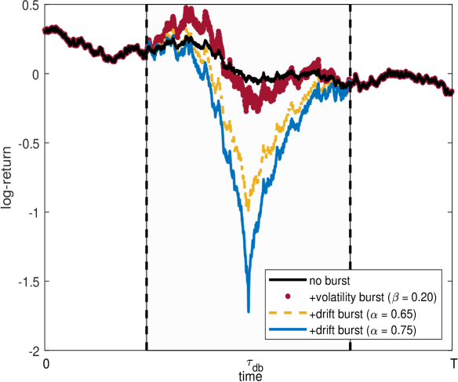

# Domain Knowledge Gained

---

## Refresh:
Return on investment: directly and strongly correlated to profitability (net income, earnings), as higher profits generally drive higher returns. Conversely, it has a weaker link with total asset value.

Equity = Assets - Liabilities

Liabilities includes but not limited to debt, taxes, and legal obligations.

## New Information
Leverage: borrowing money to amplify return on investment or project or equity RoE.

Positive leverage: return > debt -> An investment outcome where the cost of borrowing is less than the return on the asset, boosting overall returns.

High leverage: High debt/equity -> A capital structure choice where a company or investor has a high debt-to-equity ratio, regardless of whether that debt is profitable.

Similarly we can say about negative, and low leverages.

Volatility: measure of how much a price (or return) varies over time. Higher volatility = larger and more unpredictable price swings. Usually measured as standard deviation of log-returns over a rolling window.

Regime: a distinct statistical state the market is in. Different regimes have different volatility levels, return distributions, and dynamics. The market doesn't stay in one regime forever — it switches.

Volatility Clustering: high volatility tends to follow high volatility, low follows low. If the market was turbulent yesterday, it's more likely turbulent today. Formally: squared returns are autocorrelated even when raw returns are not.

Regime change: a structural shift from one regime to another — e.g., calm market transitioning into a stress period. Not a single bad day, but a sustained change in the underlying dynamics.

Volatility burst: jumps in volatility while recurring (come back to same) cluster

One-Off Burst (e.g., Drift Burst/Jump): sudden, temporary, isolated, single event
The drift burst hypothesis

 
> source: https://arxiv.org/html/2601.08974v2