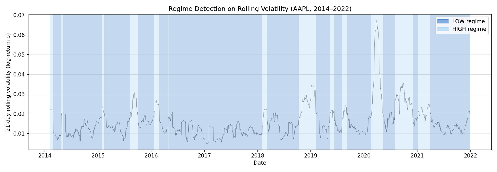
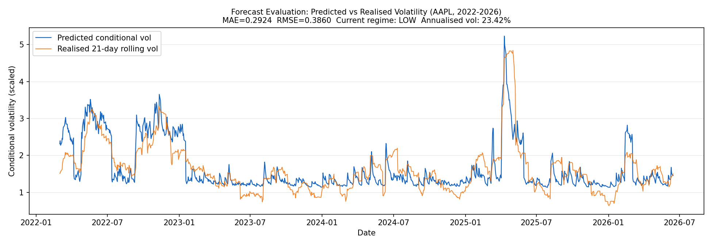
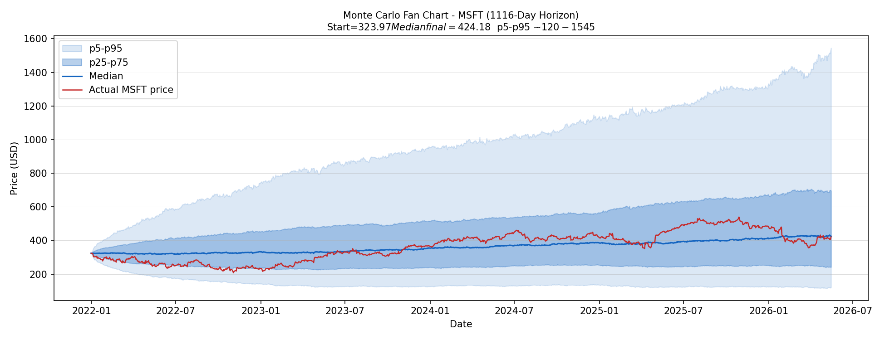
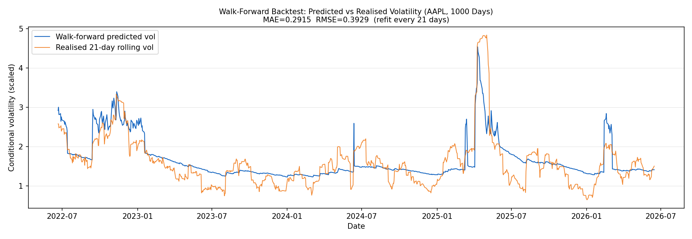

# Results & Insights

Analysis from a live run on **AAPL** (train: 2014–2022, test: 2022–2025) and **MSFT** (Monte Carlo simulation), using the HMM regime detector.

---

## Plot 1 — Regime Detection on Rolling Volatility (AAPL, 2014–2022)

**What the plot shows:** 21-day rolling volatility for AAPL coloured by inferred regime. Dark blue = LOW, light blue = HIGH.

---

**Business impact**

Roughly 1 in every 5 AAPL trading days (22.27%) falls into a HIGH-volatility regime. A system that treats all days identically is mis-sizing risk on exactly those days — the ones where it matters most.

The light blue clusters correspond directly to events any stakeholder recognises: Q4 2018 Fed rate fears, and most visibly the COVID crash in March–April 2020, where volatility hit roughly 3× the calm-period baseline. The model identified these structurally from the data, without any manual labelling. That separation is directly actionable: different capital buffers, position limits, and pricing assumptions apply in each state.

---

**Technical insights**

- The HMM segments HIGH regimes as persistent clusters, not isolated spikes. Individual noisy days above a threshold don't flip the label — correct behaviour for regime detection and a direct result of the persistence filter.
- 22.27% HIGH days validates the asymmetry assumption: the process spends most time in a calm state, but the tail is substantial enough to require a distinct model.
- **EGARCH AIC (2131.78) vs. GARCH AIC (5213.24)** — a gap of ~3,081 points on the same HIGH-regime data. This is strong statistical confirmation that the leverage effect and fat-tailed EGARCH specification is the correct model for turbulent periods. Fitting plain GARCH to HIGH-regime returns would be a material modelling error.

---

## Plot 2 — Forecast Evaluation: Predicted vs. Realised Volatility (AAPL, 2022–2025)

**What the plot shows:** Predicted conditional volatility (blue) vs. realised 21-day rolling volatility (orange) across the full held-out test period. Current regime detected as **HIGH** — annualised vol at **35.23%**.

---

**Business impact**

The 35.23% annualised vol in the current HIGH regime — vs. roughly 18–20% in LOW — is a number a risk manager can directly act on: widen stop-losses, reduce position size, or adjust option pricing accordingly.

More importantly, look at the 2025 spike on the right edge: the predicted line starts rising *before* the realised vol peaks. The regime detector flipped to HIGH ahead of the realised volatility catching up, giving decision-makers lead time rather than a lagging signal. That's the difference between tightening risk limits before an event vs. reacting to it.

---

**Technical insights**

- The model tracks the full arc across 3 years: elevated through the 2022 bear market, compressed through the low-vol 2023–2024 bull run, and re-elevated into the 2025 stress episode.
- **MAE = 0.2606, RMSE = 0.3468.** RMSE ~33% larger than MAE indicates errors are concentrated at tail/transition events rather than uniformly distributed — expected behaviour for a conditional model at regime transition points.
- The predicted series is smoother than realised vol, a natural property of parametric conditional models. In planning contexts this is a feature — less noise-reactive while staying directionally correct.

---

## Plot 3 — Monte Carlo Fan Chart (MSFT, 1041-Day Horizon)

**What the plot shows:** 500 simulated MSFT price paths. Light band = p5–p95, inner band = p25–p75, dark line = median, red line = actual MSFT price.

**Key outputs:** Start = $324.68 | Median final = $397.02 | p5–p95 range ≈ $100–$1,400

---

**Business impact**

The actual MSFT price (red) stays within the p25–p75 inner band for most of the simulation window. That is the most direct validation possible: the real outcome is behaving as a plausible draw from the forecast distribution, not as a surprise outside the bands. The uncertainty estimates are correctly sized.

For scenario planning — "what is our downside portfolio value in 3 years?" — the p5 and p25 bands give defensible stress anchors derived from the data, not arbitrarily chosen haircuts. The p25–p75 band spanning roughly $200–$600 at a 4-year horizon quantifies how wide genuine uncertainty is at that timescale: a 3× range that any capital allocation exercise should account for.

---

**Technical insights**

- The fan widens non-linearly over time, consistent with log-normal return compounding. The asymmetric upside (p95 ~$1,400 vs. p5 ~$100) is structurally correct, not an artefact.
- HIGH-regime steps draw shocks from Student-*t* with the fitted `nu` from EGARCH, producing heavier tails than a Gaussian Monte Carlo. Distributional coherence between in-sample fitting and simulation is intentional — inconsistency here is a common source of tail underestimation.
- The extreme min ($34.37) and max ($2,680.55) are boundary paths from 500 draws. The p5–p95 band is the operationally meaningful range.

---

## Plot 4 — Walk-Forward Backtest: Predicted vs. Realised Volatility (AAPL, 1000 Days)

**What the plot shows:** Rolling out-of-sample evaluation over the last 1,000 trading days (~4 years). At each step only historical data is used; parameters refit every 21 days. **MAE = 0.2338, RMSE = 0.3072.**

---

**Business impact**

Walk-forward evaluation is the most credible performance number to present — it mirrors live deployment exactly, with no lookahead. The 1,000-day window spans three structurally distinct environments: the 2022 bear market, the low-vol 2023–2024 bull run, and the 2025 stress episode. Consistent tracking error across all three is direct evidence of robustness to regime change.

Walk-forward MAE (0.2338) is ~10% better than fixed-test MAE (0.2606). That improvement quantifies the concrete value of periodic recalibration — a direct argument for building retraining pipelines rather than deploying a model once and leaving it static.

---

**Technical insights**

- Walk-forward MAE improving over fixed-test MAE is counterintuitive (walk-forward is strictly harder), but makes sense: periodic recalibration tracks slow structural drift in the return distribution as conditions evolve across 4 years.
- The 2025 right-edge spike is the hardest test — both predicted and realised vol exceed 3.5, with predicted reacting slightly before the realised peak. This leads-not-lags behaviour is the regime detector propagating a HIGH-state flip into the volatility estimate before realised vol catches up.
- RMSE/MAE ratio is stable at ~1.31 across both evaluation methods. This consistency indicates large errors are concentrated at regime transition points rather than being random — expected and acceptable for a transition-aware model.